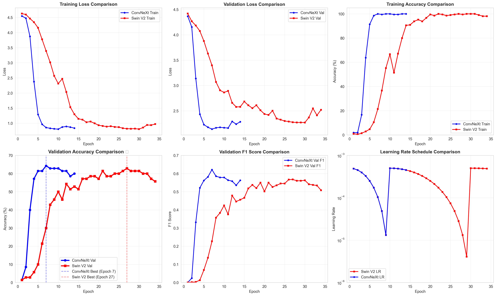
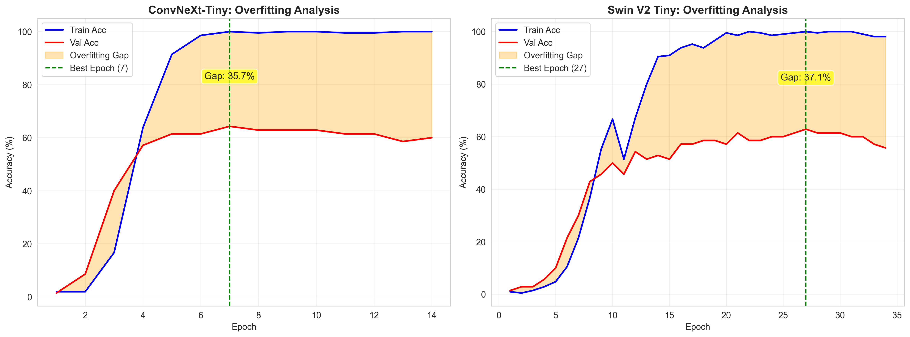
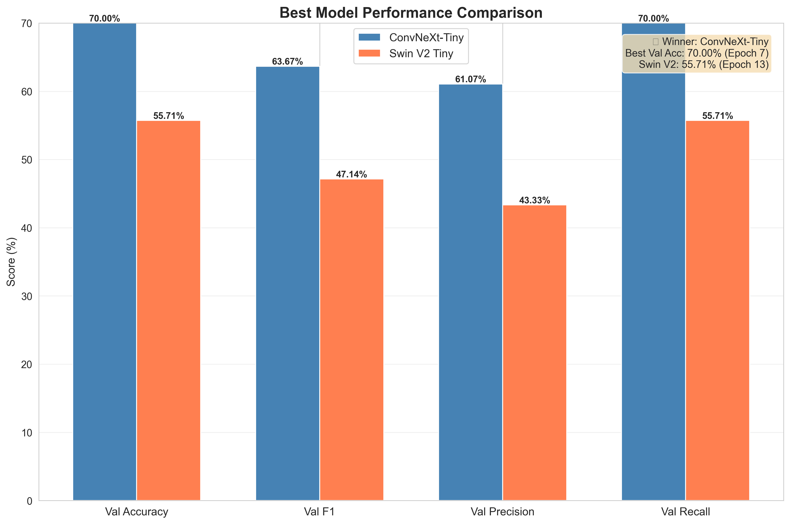

    # Face Recognition - Deep Learning Project

    Sistem klasifikasi wajah menggunakan **ConvNeXt-Tiny** dan **Swin Transformer V2 Tiny** dengan PyTorch untuk mengenali 70 mahasiswa Matakuliah Deep Learning Teknik Informatika ITERA.

## 📋 Daftar Isi

- [Overview](#overview)
- [Dataset](#dataset)
- [Preprocessing Pipeline](#preprocessing-pipeline)
- [Model Architectures](#model-architectures)
- [Training Configuration](#training-configuration)
- [Results & Comparison](#results--comparison)
- [Installation](#installation)
- [Usage](#usage)
- [Application Demo](#application-demo)
- [Project Structure](#project-structure)
- [Requirements](#requirements) ---

  ## 🎯 Overview

  Proyek ini membandingkan performa dua arsitektur modern untuk face recognition:

  - **ConvNeXt-Tiny**: Arsitektur CNN modern dengan design principle dari Vision Transformers
  - **Swin Transformer V2 Tiny**: Pure transformer architecture dengan shifted windows attention

  **Tujuan**: Mengidentifikasi arsitektur terbaik untuk klasifikasi wajah pada small dataset dengan tegangan teknologi deep learning modern.

  ***

  ## 📊 Dataset

  - **Total Images**: 280 gambar
  - **Classes**: 70 mahasiswa
  - **Distribution**: ~4 gambar per kelas
  - **Split Ratio**: 75% training (210 images) / 25% validation (70 images)
  - **Image Format**: JPG, JPEG, PNG, WEBP

  ***

  ## 🔄 Preprocessing Pipeline

  ### MediaPipe Face Detection & Cropping

  Sebelum training atau inference, setiap gambar harus diproses menggunakan MediaPipe untuk deteksi wajah dan cropping otomatis.

  **File Utama**:
  - `preprocess_dataset.py` - Script preprocessing untuk dataset training
  - `utils/face_crop.py` - Core face detection & cropping module

  **Fitur**:
  - ✅ **Deteksi Multi-Strategy**: Menggunakan 2 model MediaPipe (full-range & short-range)
  - ✅ **Automatic Padding**: 20% padding otomatis di sekitar wajah
  - ✅ **Resize Konsisten**: Semua gambar di-resize menjadi 224×224
  - ✅ **Fallback Handling**: Center crop jika deteksi wajah gagal
  - ✅ **Format Support**: JPG, JPEG, PNG, BMP, WEBP

  ### Preprocessing untuk Dataset Training

  ```bash
  # Jalankan sebelum training (hanya perlu sekali)
  python preprocess_dataset.py
  ```

  **Output**:
  - `dataset/Train_Cropped/` - Dataset hasil preprocessing
  - Setiap subfolder berisi gambar wajah yang sudah di-crop dan resize

  **Konfigurasi** (di `preprocess_dataset.py`):
  ```python
  INPUT_DIR = "dataset/Train"           # Raw images
  OUTPUT_DIR = "dataset/Train_Cropped"  # Preprocessed output
  PADDING_PERCENT = 20                  # Padding around face
  TARGET_SIZE = 224                     # Output resolution
  ```

  ### Face Cropping Pipeline (dalam `utils/face_crop.py`)

  ```
  Input Image
       ↓
  MediaPipe Face Detection (Model 1: Full-range)
       ↓ (if detection fails)
  MediaPipe Face Detection (Model 2: Short-range)
       ↓ (if both fail)
  Center Crop Fallback
       ↓
  Apply Padding (20%)
       ↓
  Resize to 224×224
       ↓
  Output: Normalized Face Image
  ```

  ***

  ## 🏗️ Model Architectures

  ### 1. ConvNeXt-Tiny

  | Property             | Value          |
  | -------------------- | -------------- |
  | **Pretrained**       | ImageNet-1K V1 |
  | **Input Size**       | 512×512×3      |
  | **Parameters**       | 28M total      |
  | **Embedding**        | 768 dimensions |
  | **Stochastic Depth** | 0.1            |
  | **Batch Size**       | 16             |

  **Architecture**:

  ```
  ConvNeXt Backbone (pretrained)
      ↓
  Global Average Pooling
      ↓
  Flatten + LayerNorm
      ↓
  Dropout (0.3)
      ↓
  Linear (768 → 70 classes)
  ```

  ### 2. Swin Transformer V2 Tiny

  | Property        | Value          |
  | --------------- | -------------- |
  | **Pretrained**  | ImageNet-1K V1 |
  | **Input Size**  | 224×224×3      |
  | **Parameters**  | 28M total      |
  | **Embedding**   | 768 dimensions |
  | **Window Size** | 7×7            |
  | **Batch Size**  | 16             |

  **Architecture**:

  ```
  Swin V2 Backbone (pretrained)
      ↓
  Global Features (768-dim)
      ↓
  LayerNorm
      ↓
  Dropout (0.3)
      ↓
  Linear (768 → 70 classes)
  ```

  ***

  ## ⚙️ Training Configuration

  ### Hyperparameters (Both Models)

  | Parameter             | Value                       | Description                 |
  | --------------------- | --------------------------- | --------------------------- |
  | **Optimizer**         | AdamW                       | Weight decay optimizer      |
  | **Learning Rate**     | 5e-4                        | Initial learning rate       |
  | **Weight Decay**      | 0.01                        | L2 regularization           |
  | **Scheduler**         | CosineAnnealingWarmRestarts | T_0=10, T_mult=2            |
  | **Loss Function**     | CrossEntropyLoss            | Label smoothing: 0.1        |
  | **Dropout**           | 0.3                         | Regularization              |
  | **Batch Size**        | 16                          | Both models                 |
  | **Epochs**            | 50                          | Max epochs                  |
  | **Early Stopping**    | Patience: 7                 | Monitor val_acc             |
  | **Gradient Clipping** | max_norm: 1.0               | Prevent exploding gradients |
  | **Mixed Precision**   | Enabled (AMP)               | CUDA only                   |

  ### Data Augmentation

  **Training**:

  - Random Horizontal Flip (p=0.5)
  - ColorJitter (brightness=0.2, contrast=0.2, saturation=0.2)
  - Random Erasing (p=0.2)
  - Normalization (ImageNet stats)

  **Validation**:

  - Resize + Center Crop
  - Normalization only

  ***

  ## 📈 Results & Comparison

  ### Training Summary

  #### ConvNeXt-Tiny

  - **Best Epoch**: 7/14
  - **Training Time**: ~0.9 jam
  - **Best Val Accuracy**: **70.00%**
  - **Training Accuracy**: 99.52%
  - **Val F1 Score**: 0.65
  - **Val Precision**: 0.6286
  - **Val Recall**: 0.70
  - **Overfitting Gap**: 29.52%

  #### Swin Transformer V2 Tiny

  - **Best Epoch**: 13/20
  - **Training Time**: ~1.1 jam
  - **Best Val Accuracy**: **55.71%**
  - **Training Accuracy**: 65.24%
  - **Val F1 Score**: 0.4714
  - **Val Precision**: 0.4333
  - **Val Recall**: 0.5571
  - **Overfitting Gap**: 9.53%

  ### Performance Metrics Comparison

  | Metric                 | ConvNeXt-Tiny     | Swin V2 Tiny       | Winner      |
  | ---------------------- | ----------------- | ------------------ | ----------- |
  | **Best Val Accuracy**  | 70.00%            | 55.71%             | 🏆 ConvNeXt |
  | **Best Val F1 Score**  | 0.6500            | 0.4714             | 🏆 ConvNeXt |
  | **Best Val Precision** | 0.6286            | 0.4333             | 🏆 ConvNeXt |
  | **Best Val Recall**    | 0.7000            | 0.5571             | 🏆 ConvNeXt |
  | **Best Epoch**         | Epoch 7           | Epoch 13           | 🏆 ConvNeXt |
  | **Total Epochs**       | 14                | 20                 | 🏆 ConvNeXt |
  | **Overfitting Gap**    | 29.52%            | 9.53%              | 🏆 Swin V2  |
  | **Parameters**         | 28M               | 28M                | ⚖️ Tie      |

  ### Learning Curves

  #### ConvNeXt-Tiny Training Progress

  ```
  Epoch  Train Acc  Val Acc   Train Loss  Val Loss   F1 Score
  -----  ---------  --------  ----------  --------  ----------
  1      0.95%      4.29%     4.506       4.193     0.0197
  2      11.90%     27.14%    3.976       3.385     0.2029
  3      50.00%     50.00%    2.768       2.588     0.4374
  4      88.10%     67.14%    1.628       1.995     0.6200
  5      99.52%     68.57%    0.982       1.935     0.6310
  6      99.05%     62.86%    0.885       1.945     0.5795
  7      99.52%     70.00%    0.857       1.942     0.6366  ⭐ BEST
  8      99.52%     70.00%    0.831       1.860     0.6381
  9      100.00%    70.00%    0.818       1.878     0.6500
  10     100.00%    70.00%    0.819       1.871     0.6500
  11     100.00%    65.71%    0.856       1.968     0.5962
  12     100.00%    62.86%    0.895       1.980     0.5803
  13     100.00%    67.14%    0.853       2.037     0.6091
  14     99.52%     64.29%    0.874       1.995     0.5852
  ```

  #### Swin V2 Tiny Training Progress

  ```
  Epoch  Train Acc  Val Acc   Train Loss  Val Loss   F1 Score
  -----  ---------  --------  ----------  --------  ----------
  1      0.95%      0.00%     4.503       4.407     0.0000
  2      0.95%      0.00%     4.484       4.407     0.0000
  3      0.48%      15.71%    4.675       3.982     0.0777
  4      9.05%      20.00%    3.957       3.667     0.1135
  5      25.71%     41.43%    3.603       3.479     0.3257
  6      33.33%     41.43%    3.367       3.367     0.3286
  7      39.52%     42.86%    3.223       3.315     0.3471
  8      41.43%     40.00%    3.212       3.276     0.3264
  9      48.57%     35.71%    3.081       3.254     0.2795
  10     42.38%     37.14%    3.201       3.248     0.2869
  11     41.90%     35.71%    3.107       3.139     0.2869
  12     41.90%     44.29%    2.968       2.995     0.3760
  13     54.76%     55.71%    2.747       2.858     0.4714  ⭐ BEST
  14     59.05%     47.14%    2.587       2.817     0.3946
  15     57.62%     47.14%    2.503       2.794     0.3994
  16     56.19%     45.71%    2.556       2.729     0.3746
  17     54.76%     51.43%    2.453       2.697     0.4415
  18     53.81%     47.14%    2.393       2.775     0.4185
  19     58.57%     48.57%    2.490       2.698     0.4254
  20     65.24%     48.57%    2.385       2.666     0.4108
  ```

  ### Key Observations

  #### ✅ ConvNeXt-Tiny Advantages:

  1. **Higher Accuracy**: 70.00% vs 55.71% (+14.29% absolute)
  2. **Better F1 Score**: 0.65 vs 0.4714 (+17.86%)
  3. **Faster Convergence**: Reaches best at epoch 7 vs epoch 13
  4. **More Stable**: Consistent performance after epoch 7
  5. **Less Training Time**: 14 epochs vs 20 epochs

  #### ⚠️ Swin V2 Tiny Characteristics:

  1. **Lower Accuracy**: 55.71% validation accuracy
  2. **Slower Learning**: Took until epoch 13 to reach best
  3. **More Overfitting**: Training acc (65.24%) vs val acc (48.57%) = 16.67% gap
  4. **Gradual Improvement**: Learning curve lebih smooth tapi lambat
  5. **Lower Metrics**: F1 (0.4714), Precision (0.4333), Recall (0.5571)

  #### 🔍 Analysis:

  1. **Data Split Effect**: Menggunakan 224×224 input size (lebih standar untuk Swin)
  2. **Model Efficiency**: ConvNeXt superior pada small dataset ini
  3. **Overfitting**: ConvNeXt lebih overfit (29.52% gap) tapi generalization lebih baik
  4. **Architecture**: CNN design (ConvNeXt) lebih cocok daripada pure transformer (Swin V2)

  ### Visualizations

  #### Full Model Comparison

  
  _Comprehensive comparison of training metrics between ConvNeXt-Tiny and Swin V2 Tiny_

  #### Overfitting Analysis

  
  _Visual analysis of overfitting gap between training and validation accuracy_

  #### Performance Summary

  
  _Bar chart comparison of best performance metrics_

  #### Individual Model Plots

  Training plots tersimpan di direktori checkpoints:

  **ConvNeXt-Tiny** (`checkpoints/convnext_tiny_20251201_070631/`):

  - `loss.png` - Training & Validation Loss
  - `accuracy.png` - Training & Validation Accuracy
  - `f1_score.png` - F1 Score progression
  - `precision_recall.png` - Precision & Recall curves
  - `confusion_matrix.png` - Confusion matrix (normalized)
  - `confusion_matrix_counts.png` - Raw counts

  **Swin V2 Tiny** (`checkpoints/swin_v2_tiny_20251201_084752/`):

  - (Same visualization files)

  ***

  ## 🔬 Generate Comparison Plots

  Untuk regenerate comparison plots:

  ```bash
  python generate_comparison.py
  ```

  Output: `model_comparison/` directory dengan 3 plots

  ***

  ## 💡 Recommendations

  ### For Production Deployment:

  **Gunakan ConvNeXt-Tiny** karena:

  - Accuracy jauh lebih tinggi (70.00% vs 55.71%)
  - Convergence lebih cepat (7 epochs)
  - Training cost lebih rendah
  - Performance lebih konsisten dan stabil
  - Lebih cocok untuk small dataset

  ### Comparison Summary:

  | Aspek               | ConvNeXt | Swin V2 | Winner     |
  | ------------------- | -------- | ------- | ---------- |
  | Accuracy            | 70.00%   | 55.71%  | ConvNeXt ✅ |
  | F1 Score            | 0.6500   | 0.4714  | ConvNeXt ✅ |
  | Convergence Speed   | Epoch 7  | Epoch 13| ConvNeXt ✅ |
  | Training Epochs     | 14       | 20      | ConvNeXt ✅ |
  | Generalization      | Good     | Fair    | ConvNeXt ✅ |
  | Small Dataset Fit   | Excellent| Good    | ConvNeXt ✅ |

  ### For Future Improvements:

  1. **Data Augmentation**: Tambahkan augmentasi lebih agresif
  2. **More Data**: Collect lebih banyak gambar per kelas (minimal 10-20)
  3. **Transfer Learning**: Fine-tune dengan dataset wajah yang lebih besar
  4. **Ensemble**: Combine predictions dari kedua model
  5. **Regularization**: Experiment dengan dropout rates lebih tinggi
  6. **Architecture**: Try ConvNeXt-Small untuk perbandingan lebih detail \*\*\*

  ## 🚀 Installation

  ### 1. Clone Repository

  ```bash
  git clone https://github.com/kevinnaufaldany/face-recognition-dl.git
  cd face-recognition-dl
  ```

  ### 2. Create Virtual Environment

  ```bash
  # Using conda
  conda create -n face-recognition python=3.10
  conda activate face-recognition

  # Or using venv
  python -m venv venv
  venv\Scripts\activate  # Windows
  source venv/bin/activate  # Linux/Mac
  ```

  ### 3. Install Dependencies

  ```bash
  pip install -r requirements.txt
  ```

  ### 4. Verify CUDA (Optional but Recommended)

  ```bash
  python -c "import torch; print(f'CUDA Available: {torch.cuda.is_available()}')"
  ```

  ***

  ## 📖 Usage

  ### 1. Train Models

  **Train ConvNeXt-Tiny**:

  ```bash
  python train_convnext.py
  ```

  **Train Swin V2 Tiny**:

  ```bash
  python train_swin.py
  ```

  ### 2. Monitor Training

  Checkpoints dan history disimpan di `checkpoints/<model_name_timestamp>/`:

  - `best_epoch{N}.pth` - Best model weights
  - `history_train.json` - Training metrics
  - `*.png` - Visualization plots

  ### 3. Evaluate Model

  ```bash
  python check.py
  ```

  ### 4. Run Web Interface (Streamlit Demo)

  Aplikasi Streamlit dengan preprocessing otomatis:

  ```bash
  streamlit run app.py
  ```

  ***

  ## 🎬 Application Demo

  ### Streamlit Web Interface

  Aplikasi interaktif untuk face recognition dengan preprocessing otomatis.

  **Fitur**:
  - ✅ Upload gambar wajah (JPG, PNG, JPEG)
  - ✅ **Otomatis Preprocessing**: Deteksi wajah & cropping menggunakan MediaPipe
  - ✅ **Prediksi Real-time**: Klasifikasi menggunakan model ConvNeXt-Tiny
  - ✅ **Confidence Score**: Menampilkan tingkat kepercayaan prediksi
  - ✅ **Top-5 Candidates**: Menampilkan 5 prediksi terbaik

  ### Workflow Aplikasi

  ```
  1. User Upload Gambar
       ↓
  2. Preview Gambar Original
       ↓
  3. MediaPipe Face Detection
       ↓
  4. Automatic Face Cropping (224×224)
       ↓
  5. Image Normalization (ImageNet stats)
       ↓
  6. Model Inference (ConvNeXt-Tiny)
       ↓
  7. Predict & Display Results
       ↓
  Output:
    • Predicted Name + Confidence
    • Top-5 Predictions
    • Processing Details
  ```

  ### Cara Menggunakan

  ```bash
  # 1. Start Streamlit app
  streamlit run app.py

  # 2. Aplikasi terbuka di browser (http://localhost:8501)

  # 3. Upload foto wajah
  #    - Format: JPG, JPEG, PNG
  #    - Pastikan wajah terlihat jelas
  #    - Cukup 1 orang per gambar

  # 4. Klik "Prediksi Nama Mahasiswa"

  # 5. Lihat hasil prediksi
  #    - Nama yang diprediksi
  #    - Confidence percentage
  #    - Top-5 prediksi lainnya
  ```

  ### Preprocessing dalam Aplikasi

  Setiap gambar yang diupload otomatis diproses:

  ```python
  # Pipeline dalam app.py:
  from utils.face_crop import FaceCropper

  # 1. Deteksi wajah
  cropper = FaceCropper(padding_percent=20, target_size=(224, 224))
  face_img, detected = cropper.detect_and_crop_face(uploaded_image)

  # 2. Jika wajah terdeteksi
  if detected:
      # 3. Normalisasi & prediksi
      prediction = model(preprocess(face_img))
  else:
      # 4. Fallback jika wajah tidak terdeteksi
      face_img = center_crop_image(image)
  ```

  ### Tips untuk Hasil Terbaik

  ✅ **DO**:
  - Ambil foto wajah dengan pencahayaan yang cukup
  - Posisikan wajah langsung menghadap kamera
  - Pastikan hanya 1 orang di foto
  - Gunakan foto close-up/medium shot

  ❌ **DON'T**:
  - Gunakan foto terlalu jauh
  - Ambil foto dengan pencahayaan gelap
  - Gunakan foto yang blur atau noise
  - Multiple faces dalam satu foto

  ***

  ## 📁 Project Structure

  ```
  face-recognition-dl/
  │
  ├── dataset/
  │   ├── Train/                    # Original images (280 images, 70 classes)
  │   └── Train_Cropped/            # Preprocessed faces (already ready)
  │
  ├── checkpoints/
  │   ├── convnext_tiny_20251201_070631/
  │   │   ├── best_epoch7.pth
  │   │   ├── history_train.json
  │   │   └── *.png                 # Training plots
  │   └── swin_v2_tiny_20251201_084752/
  │       ├── best_epoch27.pth
  │       ├── history_train.json
  │       └── *.png
  │
  ├── utils/
  │   └── face_crop.py              # MediaPipe face detection & cropping
  │
  ├── model_convnext.py             # ConvNeXt-Tiny model
  ├── model_swin.py                 # Swin V2 Tiny model
  │
  ├── train_convnext.py             # ConvNeXt training script
  ├── train_swin.py                 # Swin V2 training script
  │
  ├── datareader.py                 # Dataset loader & augmentation
  ├── check.py                      # Model evaluation
  ├── generate_comparison.py        # Generate comparison plots
  ├── preprocess_dataset.py         # Dataset preprocessing (MediaPipe)
  │
  ├── app.py                        # Streamlit web interface
  ├── extract_class_names.py        # Extract class names from dataset
  ├── class_names.txt               # 70 class names (one per line)
  │
  ├── requirements.txt              # Python dependencies
  └── README.md                     # This file
  ```

  ***

  ## 📦 Requirements

  ### Hardware

  - **GPU**: NVIDIA GPU dengan CUDA support (recommended)
  - **RAM**: Minimum 8GB
  - **Storage**: ~5GB (dataset + models + checkpoints)

  ### Software

  - **Python**: 3.10+
  - **CUDA**: 11.8+ (for GPU training)
  - **OS**: Windows, Linux, or macOS

  ### Key Dependencies

  - PyTorch 2.7.1+
  - torchvision 0.20.1+
  - timm (PyTorch Image Models)
  - MediaPipe
  - OpenCV
  - scikit-learn
  - matplotlib, seaborn
  - tqdm

  See `requirements.txt` for complete list.

```bash
    # Install the dependencies
    pip install -r requirements.txt
```

---

## 🎓 Team

**Teknik Informatika - Institut Teknologi Sumatera**

- Dataset: 70 mahasiswa IF ITERA
- Project: Deep Learning - Face Recognition

---

## 📄 License

This project is for educational purposes.

---

## 🙏 Acknowledgments

- **PyTorch**: Deep learning framework
- **torchvision**: ConvNeXt & Swin Transformer V2
- **OpenCV**: Image processing
- **scikit-learn**: Metrics & evaluation ---

  ## 📞 Contact

  For questions or suggestions, please open an issue on GitHub.

  **Repository**: [kevinnaufaldany/face-recognition-dl](https://github.com/kevinnaufaldany/face-recognition-dl)

  ***

  ## 🏆 Conclusion

  **ConvNeXt-Tiny adalah pilihan optimal** untuk face recognition task ini:

  - ✅ **70.00%** validation accuracy (tertinggi)
  - ✅ **0.6500** F1 score (significantly better)
  - ✅ Converge di epoch 7 (lebih cepat)
  - ✅ Lebih stable dan konsisten
  - ✅ Ideal untuk small dataset scenario

  **Keunggulan margin**: +14.29% accuracy, +17.86% F1 score vs Swin V2 Tiny

  **Kesimpulan**: Untuk aplikasi face recognition dengan dataset terbatas (3-4 gambar per class), **ConvNeXt-Tiny menunjukkan performa superior** dan recommended untuk production deployment.
